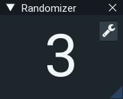
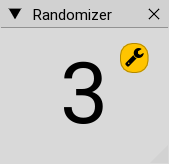
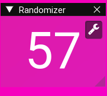

# Randomizer
#### Simple Randomizer application that generates numbers between 0 and 100 to help you making decisions easier

## Features
- Hotkey Number Generation
- Blurred windows
- TopMost Window
- Generation Timer
- 4 Themes, including HalfLife theme

## Preview

Screenshots and gifs

 

## Dependencies
- C++20
- ImGui (docking branch, already in this repository in 'imgui' folder) 
- Freetype

## Build
Just build it with the VS2019

## License
MIT
